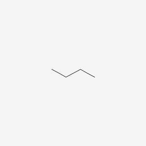

```{r setup, include=FALSE}
knitr::opts_chunk$set(echo = TRUE)
```

## Debugging R issues in IUPAC Protocols

The purpose of this document is to explore the causes (and possible solutions)
for some issues in creating the Rmd for the IUPAC Protocols

```{r preparation}
library(httr2)
library(webchem)
resolver_base_url <- "https://pubchem.ncbi.nlm.nih.gov/resolver/resolver.cgi"
```

## Issue 1: Image

This works in HTML and PDF: 

```{r saved file plain caption, out.width='25%', fig.align='center', fig.cap='Image of butane'}

```


These work in HTML only:

<!--  -->

```{r saved file URL caption, out.width='25%', fig.align='center', fig.cap='https://pubchem.ncbi.nlm.nih.gov/image/imgsrv.fcgi?t=l&cid=7843'}
#
```

```{r live file plain caption, out.width='25%', fig.align='center', fig.cap='Image of butane'}
#knitr::include_graphics('https://pubchem.ncbi.nlm.nih.gov/image/imgsrv.fcgi?t=l&cid=7843')
```


